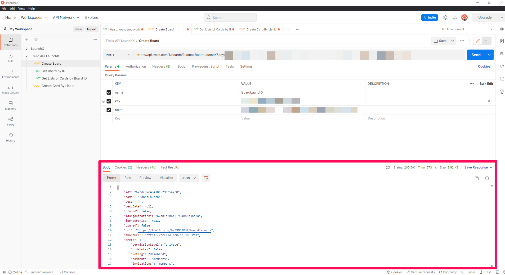
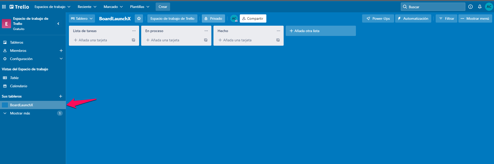
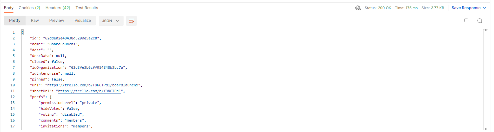
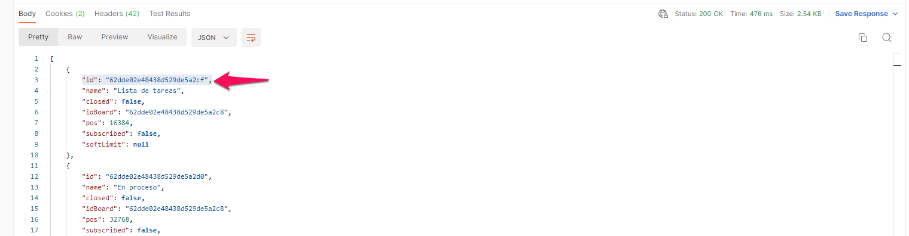
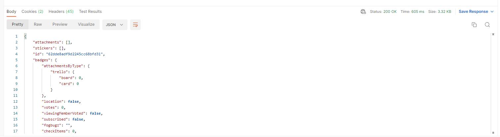
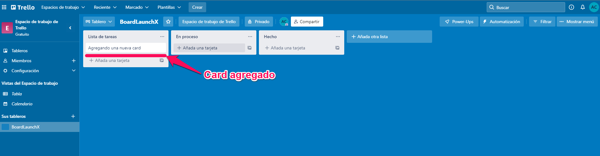
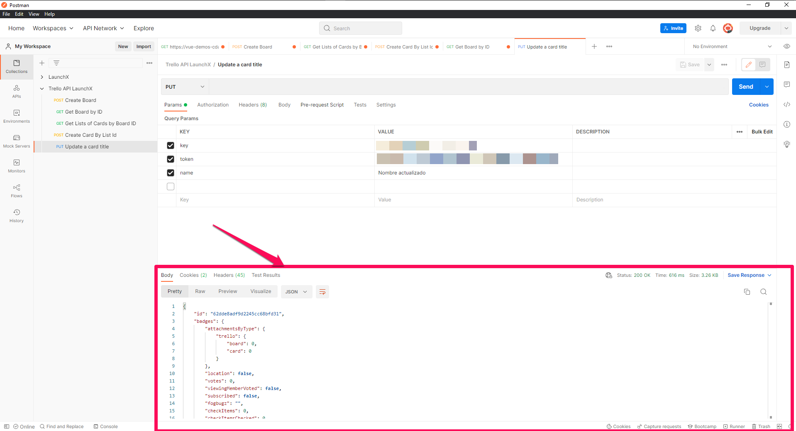
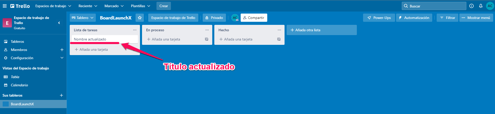
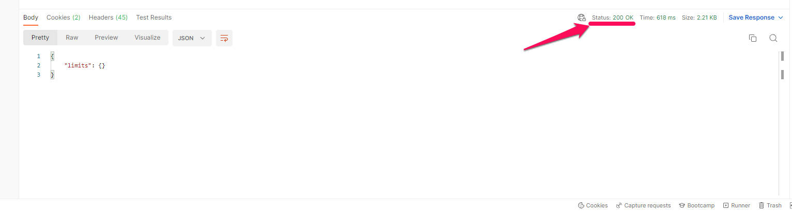

# API REST Trello

Para este proyecto se hizo uso de la API de Trello. Según su pagina oficial dice "Trello es una herramienta visual que permite a los equipos gestionar cualquier tipo de proyecto y flujo de trabajo, así como supervisar tareas. Añade archivos, checklists o incluso automatizaciones: personalízalo todo según las necesidades de tu equipo".

* Para empezar se tuvo que abrir una cuenta de Trello. Para abrir una cuenta se debe ingresar a la página oficial [https://trello.com/](https://trello.com/).
* Después, para empezar a útilizar el API Rest de Trello se necesito el API KEY y un token, que se puede solicitar en el siguiente link [https://trello.com/app-key](https://trello.com/app-key).
* Una vez obtenidos los datos anteriores se deben de guardar para poder utilizarlos más adelante.

## Usando el API de Trello con las peticiones armadas de Postman

El archivo `Trello-API-LaunchX.postman_collection.json` contiene las peticiones ya armadas en Postman las cuáles se ocuparán en este proyecto.

### Crear un tablero

Para crear un tablero se debe de seleccionar la petición llamada `Create Board` y en la sección de "Query Params" se debe de llenar los valores, los cuáles serían el campo key y token. Una vez rellenado los campos se debe dar click en send.


Una vez dado click se debe obtener respuesta en el "Response" y se debe de verificar que se haya creado el tablero.

`Respuesta en el response`



`Tablero creado`



Por último, en el response se muestra el ID del tablero que se creó, se debe de guardar ya que se ocupará más adelante.

### Obtener la información del board a partir de su ID

Para obtener la información del board a partir del ID se debe utilizar la petición `Get Board By ID`, y se deben de llenar los valores que se piden que sería la API KEY y el Token. Antes de envíar el request se debe modificar el URL, justo después de `/1/boards`, se debe de quitar el valor que esta ahí y se debe de poner el ID del board creado anteriormente.

```
https://api.trello.com/1/boards/BOARDID/lists?key=APIKEY&token=TOKEN
```

Una vez realizado lo anterior se envía el request y en el response se muestra la información del board, como se muestra a continuación:

`Respuesta en el response`



### Obtener la lista de columnas del board creado

Para este paso se debe de utilizar la petición llamada `Get Lists of Cards by Board ID` y nuevamente se debe agregar el API KEY Y el Token.

Antes de envíar el request se debe modificar el URL, justo después de `/1/boards`, se debe de quitar el valor que esta ahí y se debe de poner el ID del board creado anteriormente.

```
https://api.trello.com/1/boards/BOARDID/lists?key=APIKEY&token=TOKEN
```

Una vez hecho lo anterior se envía el request y en el response se debe de verificar la información que se recibe. Se debe de obtener como respuesta la lista de columnas que se tiene en el tablero, como se muestra a continuación:

`Respuesta en el response`



Se debe guardar el ID del primer registro que corresponde a la primer columnas, ya que se utilizará más adelante.

### Agregar nuevas cards a la primer columna del tablero

Se debe utilizar el request POST `Create Card By List Id` y de la misma forma se deben de agregar los parámetros necesarios: `idList`(el id de la primer columna del paso anterior), `key`, `token` y el `name`(es el título de la nueva card, puede ser cualquier nombre).

Una vez rellenado los campos solicitados se envía el request y se debe verificar que la respuesta sea exitosa.

`Respuesta en el response`



Y así mismo también se debe verificar que se haya creado en la app de Trello, como se muestra a continuación:

`Card agregado`



### Actualizar el título de una card

Para actualizar el título de una card se debe hacer uso del request PUT `Update a card title`. 

También se deben de llenar los valores que se piden, en este caso serían la API KEY, el Token y el nuevo nombre (name). Así mismo se debe modificar la URL, justo después de `/1/cards/`, en donde dice `CARDID` se debe colocar el ID del card que fue creado en el paso anterior.

```
https://api.trello.com/1/cards/CARDID?key=APIKEY&token=TOKEN
```

Una vez modificado el URL se envía la petición y debemos de verificar que tenemos que la respuesta sea exitosa.

`Respuesta en el response`



`Título actualizado en la app de Trello`



### Eliminar una card

Para eliminar una card se debe utilizar el request `Delete a card` y rellenar los parámetros necesarios, lo que es el API KEY y el token. Así mismo en la URL se debe colocar el ID, como en el paso anterior en donde se actualizó el nombre la card.

```
https://api.trello.com/1/cards/CARDID?key=APIKEY&token=TOKEN
```

Una vez hecho lo anterior se envía la petición y se puede verificar en el response que obtiene el status de 200, esto quiere decir que esta bien, que el card se ha eliminado.

`Respuesta del response`



Y por último, se puede verificar en la app de Trello que la card se ha eliminado.